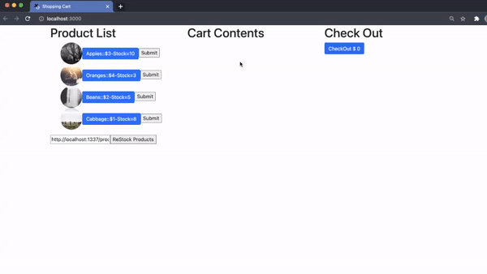

# Shopping-Cart Exercise

A raw solution for a Shopping-Cart exercise

## Tasks:

- Implement the restock feature when a user clicks the "ReStock Products" button, a call is made to the Strapi backend specified in the input field.
- The result of this call should be updated on the list of products.

## Solution
I use `doFetch` function to make a call to the API and use `setItem` to update the existing items as shown below;
```javaScript
const restockProducts = (url) => {
    doFetch(url);
    let newItems = data.map((item) => {
      let { name, country, cost, instock } = item;
      return { name, country, cost, instock };
    });
    setItems([...items, ...newItems]);
  };
```
## Usage

 

[Live demo](#)

## License
[MIT](https://github.com/anyapages/shopping-cart-exercise/blob/main/LICENSE) 
